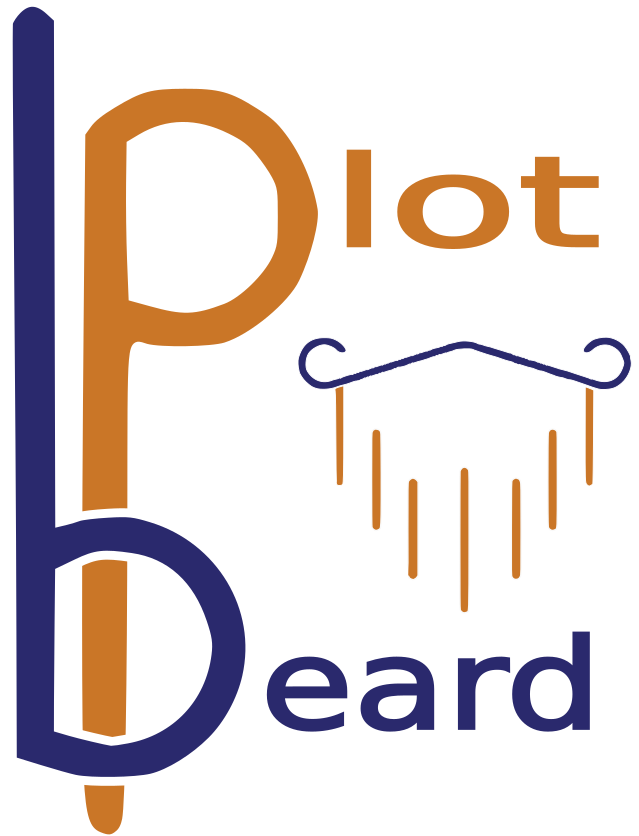
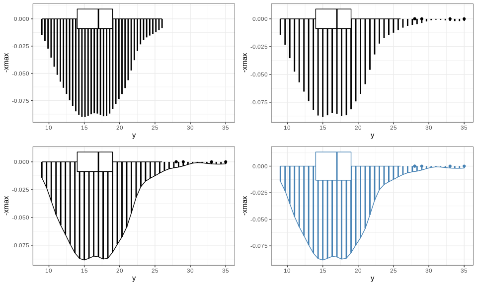
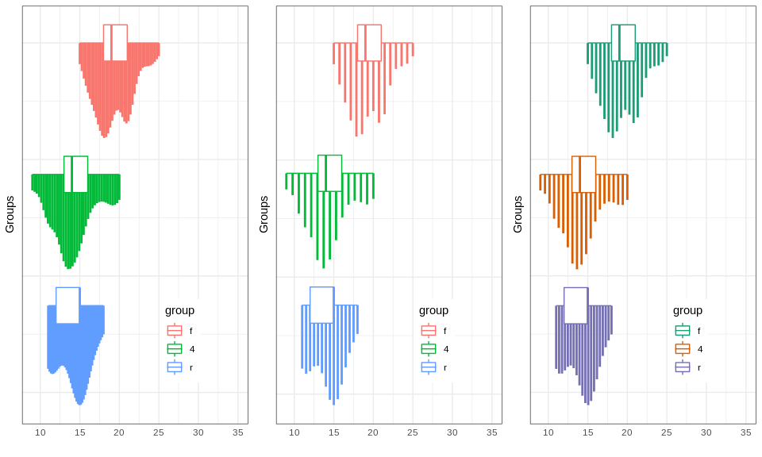

Overview
--------

The **gg\_beardplot** package provide ad easy tool based on ggplo2 to
visualize the distribution of the data and its probability density. It
is similar to the violin plot, the rain-cloud-plot, the bean plot and
others of this kind, but the gg\_beardplot reproduce the famous Fisher
beard ;)

How to use gg\_beardplot
------------------------

``` r
source("gg_beardplot.R")
library(ggpubr)
```

Let’s start with 3 simple examples

``` r
#Basic case
p1 <- gg_beardplot(data = mpg, x = cty)

#include the outliers
p2 <-gg_beardplot(data = mpg, x = cty, outliers = TRUE)

#include the density line
p3 <- gg_beardplot(data = mpg, x = cty, outliers = TRUE, smile = TRUE)

#change the width of the boxplot and the color
p4 <- gg_beardplot(data = mpg, x = cty, outliers = TRUE, smile = TRUE, 
                   width_boxplot = 1.5, color = 'steelblue')

ggarrange(p1, p2, p3, p4)
```



Plot different groups!

``` r
#set theme 
theme <- theme(legend.position = c(0.7, 0.2), axis.text.y = element_blank(), 
               axis.ticks=element_blank()) 
labs <- labs( y = "", x = "Groups")
#basic case
p5 <- gg_beardplot(data = mpg, x = cty, group = drv) +
        theme + labs

#Talking about style, the beard thickness can be controlled (beard_fullness=). 
#The default value is 40, and represents the number of lines for each plot
p6 <- gg_beardplot(data = mpg, x = cty, group = drv, beard_fullness=15)+
        theme + labs

#change the colors
p7 <- gg_beardplot(data = mpg, x = cty, group = drv, beard_fullness=20) +
        scale_color_brewer(palette = "Dark2") + theme + labs

ggarrange(p5, p6, p7, ncol = 3)
```


